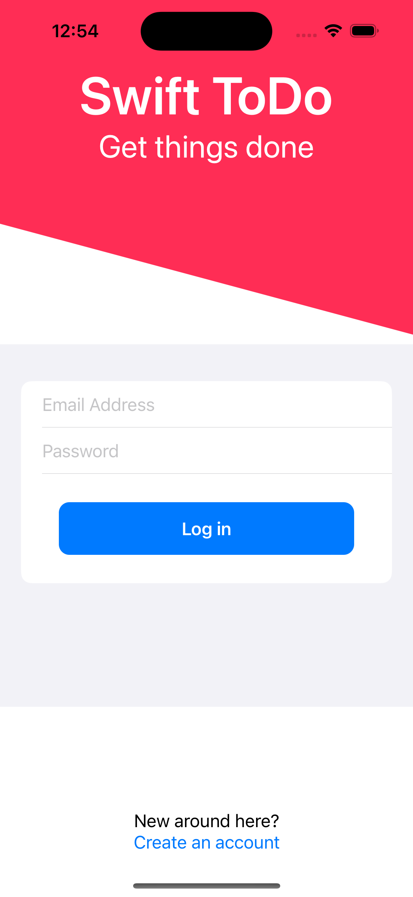
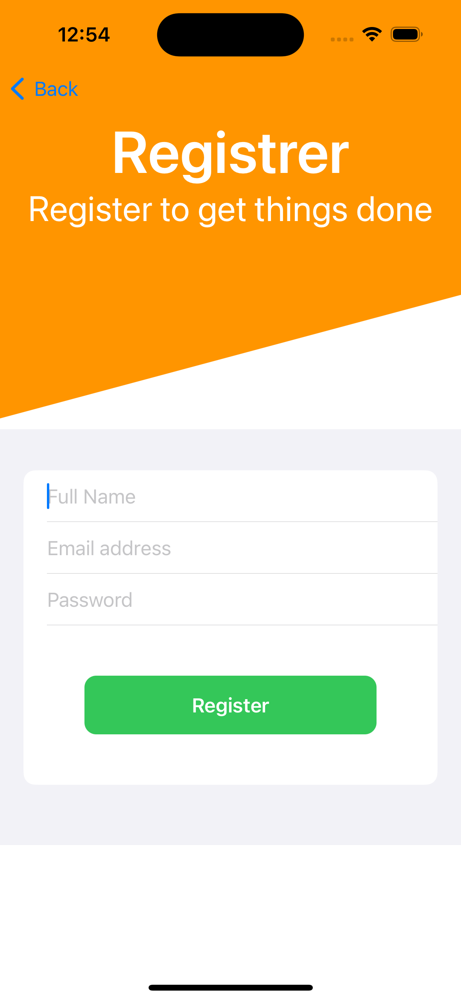
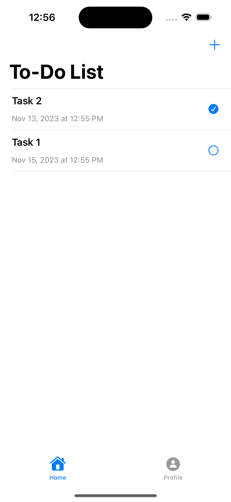
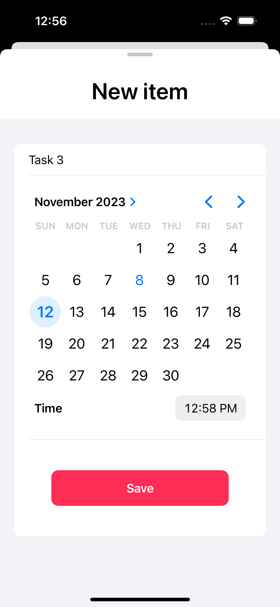
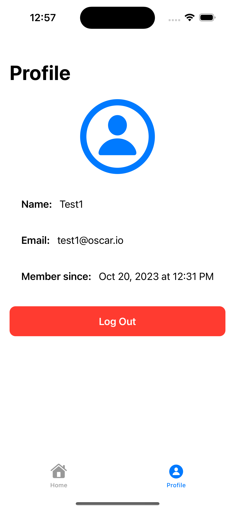

# Swift ToDo ios app

An iOS todo list app created with SwiftUI by Oscar NGUYEN.

This project serves as a learning experience in SwiftUI. You can find detailed instructions for building this app in [this YouTube tutorial](https://www.youtube.com/watch?v=t_mypMqSXNw).

## Demo & Snippets

#### Log in screen

  

#### Register screen

  

#### Main screen

  

#### Add new task item screen

  

#### Profile screen

## 

## Requirements / Purpose

### MVP

- Use Google Firestore API to store user details and to-do lists.
- Utilize Google Auth API for user registration and login.
- Allow users to view and create to-do items.
- Enable users to mark items as done.

### Purpose of project

- Learn the basics of SwiftUI through a practical project.

### Stack used

- Swift
- SwiftUI
- Google Firebase (Auth and Firestore)

---

## Build Steps

The Xcode project file and its resources can be found in the `Swift_ToDo` folder. You can open it using the Xcode application.

---

## Features

- Users can register a new account
- Users can log in / log out of their account
- Users can create a new task item
- Users can view their own created task items
- Users can mark a task as done

---

## Known issues

- Users can not edit or delete created task items
